<code>$ ./whoami --verbose</code>

 

> I started out shipping cross-platform mobile apps with **Flutter + Firebase**, and grew into full-stack web development across **React, NestJS and PostgreSQL**. I care about clean architecture, real deployments, and building things people actually use.
>
> 🎓 BSCS @ Air University, Islamabad (Class of '27) &nbsp;·&nbsp; 📍 Islamabad / Rawalpindi, PK &nbsp;·&nbsp; 🌐 [jawadmansoor.dev](https://jawadmansoor.dev)

 

## `>` Tech Stack

<table>
<tr><td><b>Mobile</b></td><td>

</td></tr>
<tr><td><b>Frontend</b></td><td>

</td></tr>
<tr><td><b>Backend</b></td><td>

</td></tr>
<tr><td><b>Tools</b></td><td>

</td></tr>
</table>

 

## `>` GitHub Stats

---

<code>// obsessed with the intersection of ideas and execution</code>

